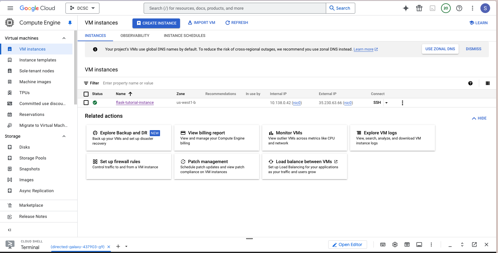
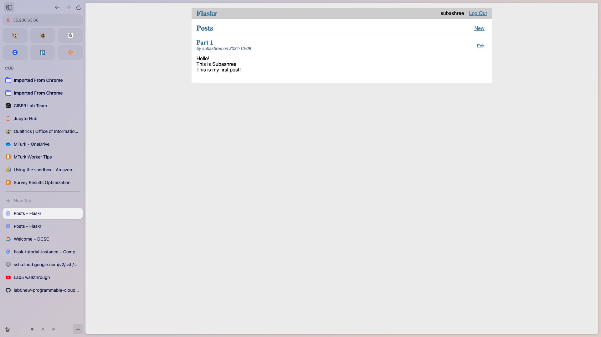
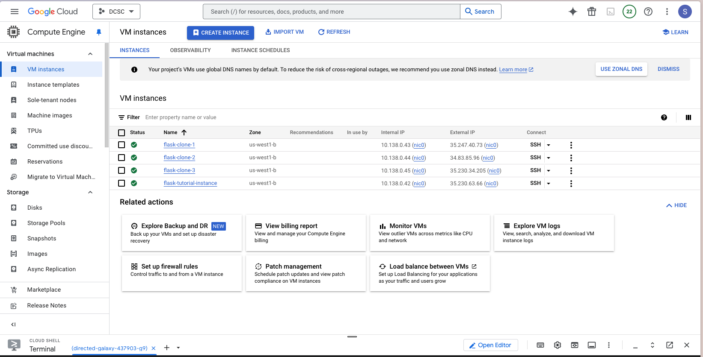
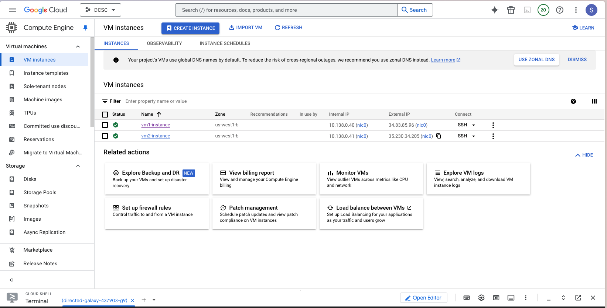
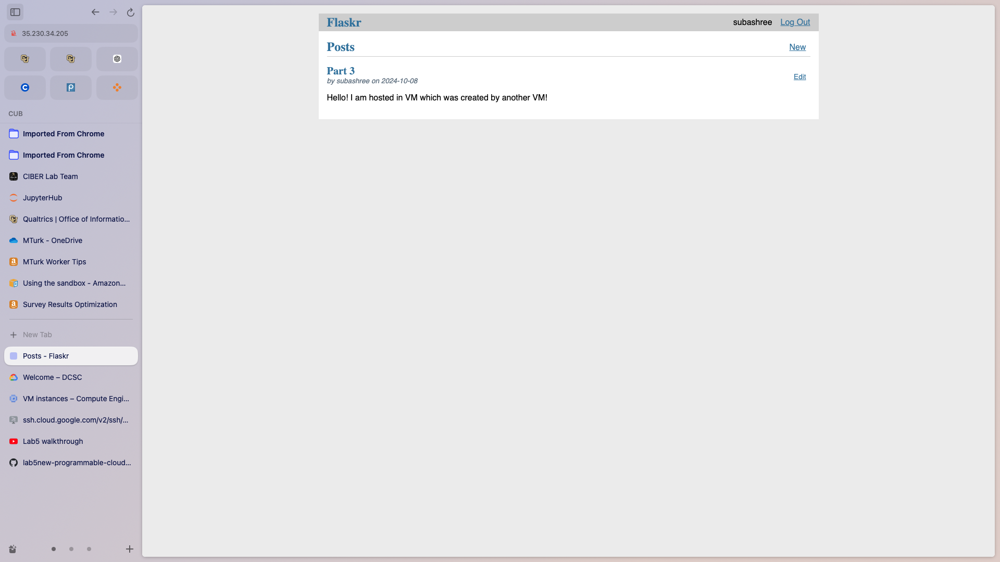

# Results:

## Part 1:

### Part 1 instance

### Part 1 Output

## Part 2:

### Part 2 instance

### Time:
- flask-clone-1: 53.03 seconds
- flask-clone-2: 42.81 seconds
- flask-clone-3: 33.08 seconds

## Part 3:

### Part 3 instance

### Part 3 Output
